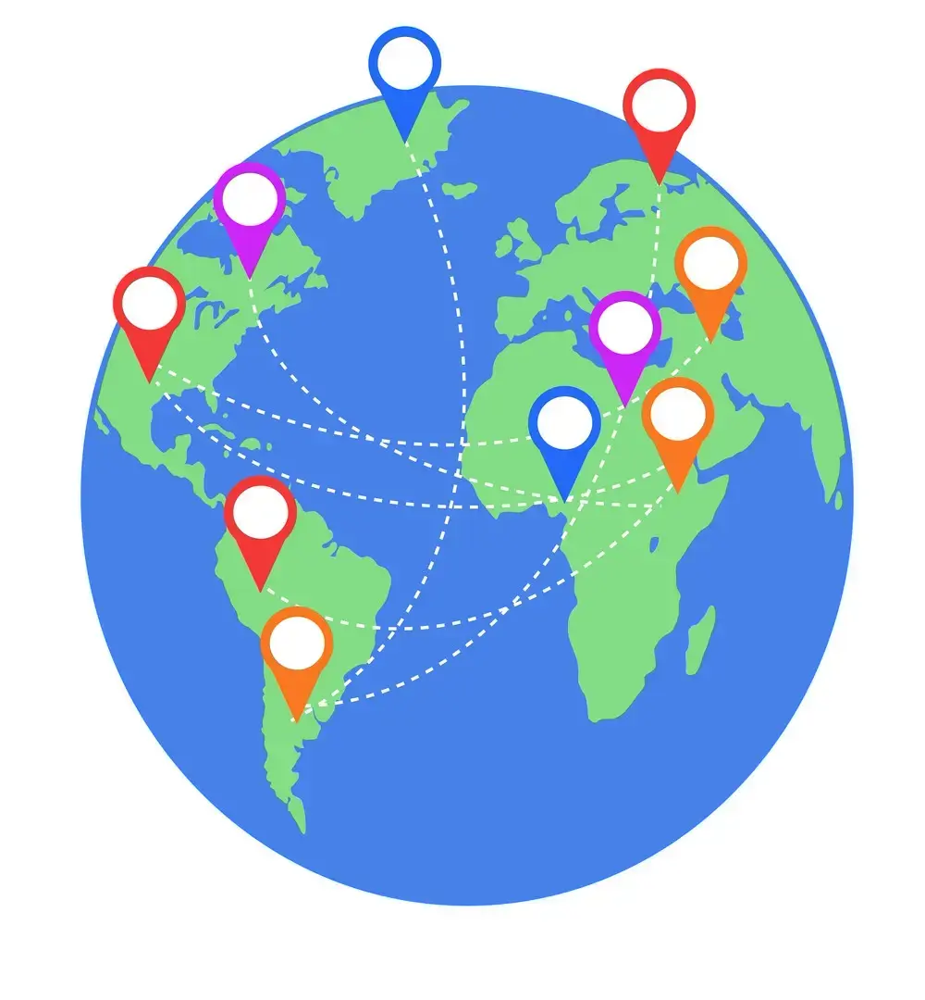
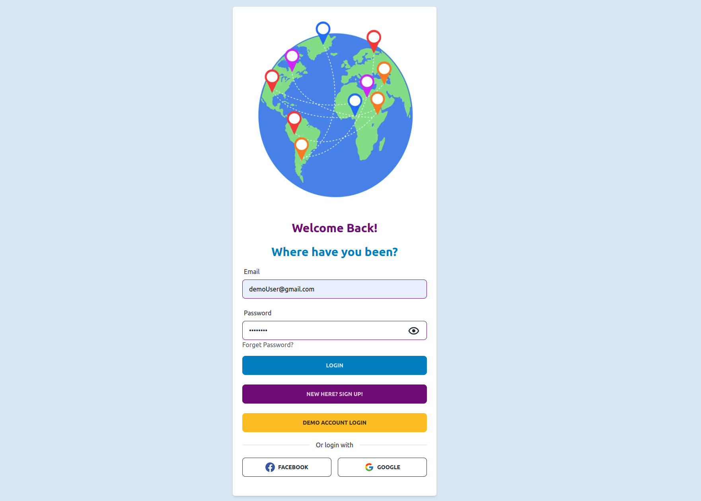
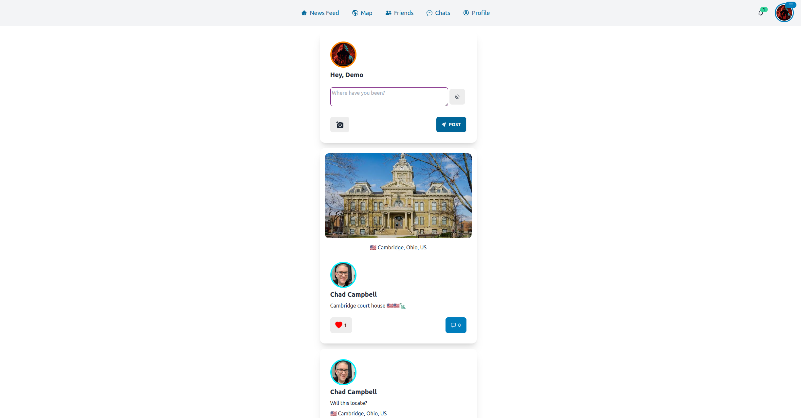
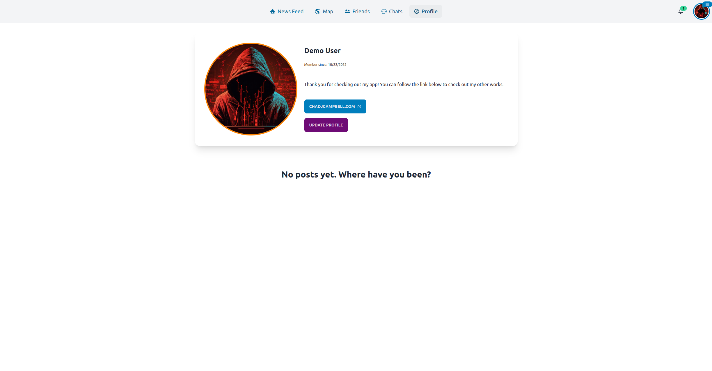
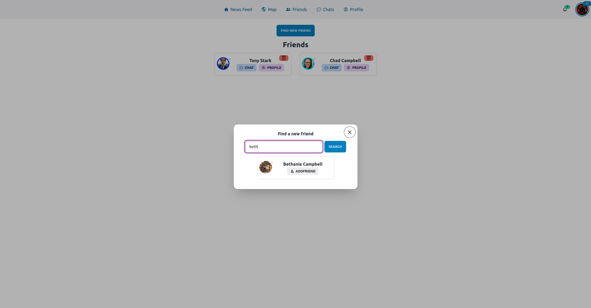
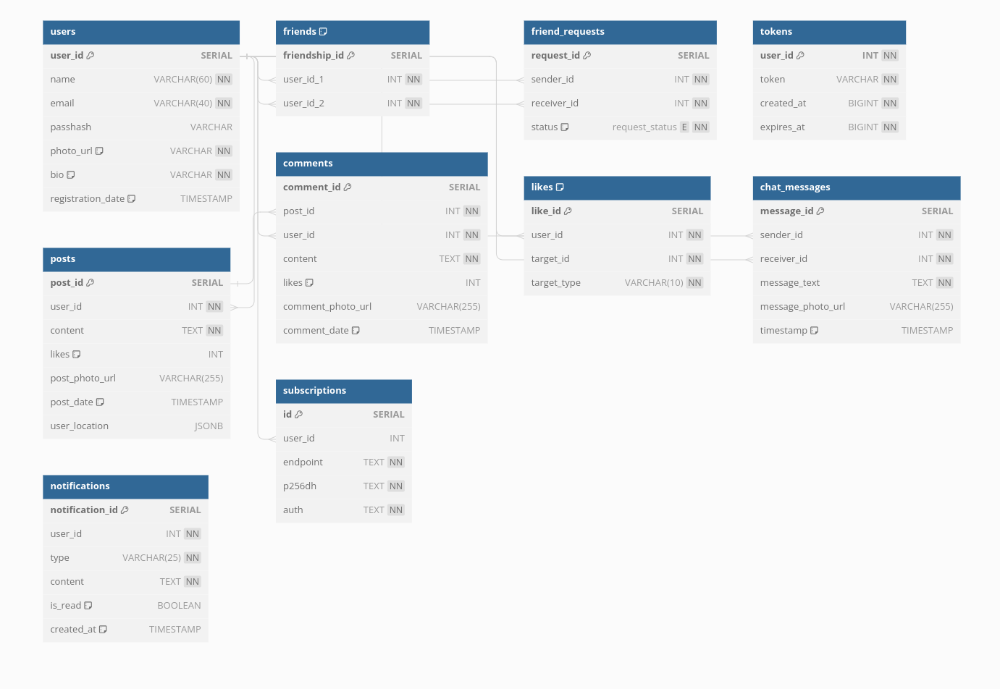

<!-- Improved compatibility of back to top link: See: https://github.com/othneildrew/Best-README-Template/pull/73 -->

<a name="readme-top"></a>

<!--
*** Thanks for checking out the Best-README-Template. If you have a suggestion
*** that would make this better, please fork the repo and create a pull request
*** or simply open an issue with the tag "enhancement".
*** Don't forget to give the project a star!
*** Thanks again! Now go create something AMAZING! :D
-->

<!-- PROJECT SHIELDS -->
<!--
*** I'm using markdown "reference style" links for readability.
*** Reference links are enclosed in brackets [ ] instead of parentheses ( ).
*** See the bottom of this document for the declaration of the reference variables
*** for contributors-url, forks-url, etc. This is an optional, concise syntax you may use.
*** https://www.markdownguide.org/basic-syntax/#reference-style-links
-->

<!-- PROJECT LOGO -->
<br />
<div align="center">
  <a href="https://github.com/chadjcampbell/been-there">
    
  </a>

<h3 align="center">Been There - PERN stack social media site</h3>

  <p align="center">
    <br />
    <a target='_blank' href="https://been-there.vercel.app/"><strong>View Demo</strong></a>
    ·
    <a href="https://github.com/chadjcampbell/been-there/issues">Report Bug</a>
    ·
    <a href="https://github.com/chadjcampbell/been-there/issues">Request Feature</a>
  </p>
</div>

<!-- TABLE OF CONTENTS -->
<details>
  <summary>Table of Contents</summary>
  <ol>
    <li>
      <a href="#about-the-project">About The Project</a>
      <ul>
        <li><a href="#built-with">Built With</a></li>
      </ul>
    </li>
    <li>
      <a href="#getting-started">Getting Started</a>
      <ul>
        <li><a href="#installation">Installation</a></li>
      </ul>
    </li>
    <li><a href="#features">Features</a></li>
    <li><a href="#roadmap">Roadmap</a></li>
    <li><a href="#contributing">Contributing</a></li>
    <li><a href="#contact">Contact</a></li>
  </ol>
</details>

<!-- ABOUT THE PROJECT -->

## About The Project

<div align="center">
    
</div>
"Been There" is a social media app designed to help users share their travel experiences and adventures with others. With "Been There," users can post pictures and content while tagging their locations on a map, creating a visual record of the places they've visited. This app allows individuals to connect, share travel tips, and discover new destinations based on the experiences of fellow users. Whether you're a seasoned traveler or looking for inspiration for your next journey, "Been There" provides a platform for exploring the world through the eyes of its community members.

<p align="right">(<a href="#readme-top">back to top</a>)</p>

### Built With

- [![React][react.js]][react-url]
- [][typescript-url]
- [][router-url]
- [][framer-url]
- [][rtk-url]
- [][vite-url]
- [][vitest-url]
- [][testing-libray-url]
- [][postgres-url]
- [][node-url]
- [][express-url]

<p align="right">(<a href="#readme-top">back to top</a>)</p>

<!-- GETTING STARTED -->

## Getting Started

To get a local copy up and running follow these simple example steps.

### Installation

1. Clone the repo
   ```sh
   git clone https://github.com/chadjcampbell/been-there.git
   ```
2. You'll need to make and fill out the .env files in client and server, based on the example

3. Install frontend NPM packages and start client
   ```sh
   cd client
   npm i
   npm run dev
   ```
4. Install backend NPM packages and start server
   (_from root of repo_)
   ```sh
   cd server
   npm i
   npm run dev
   ```

<p align="right">(<a href="#readme-top">back to top</a>)</p>

<!-- USAGE EXAMPLES -->

## Features

News Feed: The app's central feature is a real-time, dynamic news feed where users can create posts, including images and textual content. These posts are displayed in a scrollable feed, allowing users to interact with, like, and comment on each other's updates.

Friends: Users can establish and manage their social connections within the app. The "Friends" feature enables user-to-user connections, creating a personalized network where they can easily access and interact with content from their friends.

Chat: In-app messaging enhances user engagement and communication. The chat feature enables real-time, private conversations between users. It's a convenient way to share travel tips, coordinate plans, or simply stay in touch while exploring the world.

Leaflet Map: The app utilizes the Leaflet mapping library to create an interactive map that displays location-tagged posts from a user's friends. It provides a visual representation of their friends' journeys, allowing users to explore the world through their network's shared experiences.

<div align="center">
    
    
    
    
</div>

<p align="right">(<a href="#readme-top">back to top</a>)</p>

<!-- ROADMAP -->

## Roadmap

- [ ] More tests
- [ ] Apply for Facebook login
- [ ] Add local news cards to news feed page

<p align="right">(<a href="#readme-top">back to top</a>)</p>

<!-- CONTRIBUTING -->

## Contributing

Contributions are what make the open source community such an amazing place to learn, inspire, and create. Any contributions you make are **greatly appreciated**.

If you have a suggestion that would make this better, please fork the repo and create a pull request. You can also simply open an issue with the tag "enhancement".
Don't forget to give the project a star! Thanks again!

1. Fork the Project
2. Create your Feature Branch (`git checkout -b feature/AmazingFeature`)
3. Commit your Changes (`git commit -m 'Add some AmazingFeature'`)
4. Push to the Branch (`git push origin feature/AmazingFeature`)
5. Open a Pull Request

<p align="right">(<a href="#readme-top">back to top</a>)</p>

<!-- CONTACT -->

## Contact

Email: chadjcampbell@gmail.com

<p align="right">(<a href="#readme-top">back to top</a>)</p>

<!-- MARKDOWN LINKS & IMAGES -->
<!-- https://www.markdownguide.org/basic-syntax/#reference-style-links -->

[linkedin-shield]: https://img.shields.io/badge/-LinkedIn-black.svg?style=for-the-badge&logo=linkedin&colorB=555
[linkedin-url]: https://linkedin.com/in/linkedin_username
[react.js]: https://img.shields.io/badge/React-20232A?style=for-the-badge&logo=react&logoColor=61DAFB
[react-url]: https://reactjs.org/
[bootstrap.com]: https://img.shields.io/badge/Bootstrap-563D7C?style=for-the-badge&logo=bootstrap&logoColor=white
[bootstrap-url]: https://getbootstrap.com
[framer-url]: (https://www.framer.com/motion/)
[typescript-url]: (https://www.typescriptlang.org/)
[router-url]: (https://reactrouter.com/en/main)
[jest-url]: (https://jestjs.io/)
[testing-url]: (https://testing-library.com/)
[chakra-url]: (https://chakra-ui.com/)
[vite-url]: (https://vitejs.dev/)
[firebase-url]: (https://firebase.google.com/)
[vitest-url]: (https://vitest.dev/)
[testing-libray-url]: (https://testing-library.com/)
[postgres-url]: (https://www.postgresql.org/)
[node-url]: (https://nodejs.org/en)
[express-url]: (https://expressjs.com/)
[rtk-url]: (https://redux-toolkit.js.org/)
